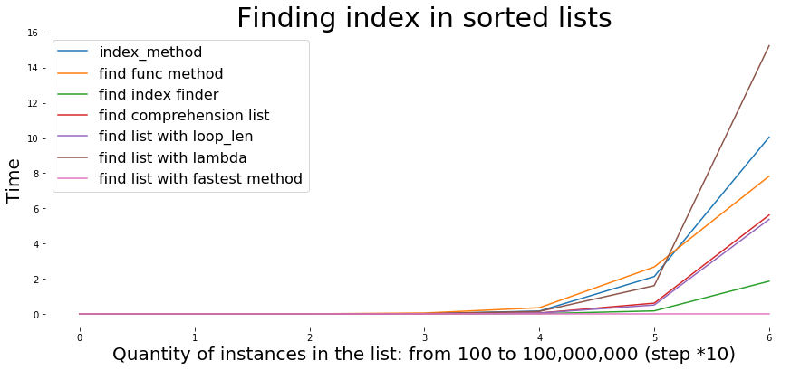
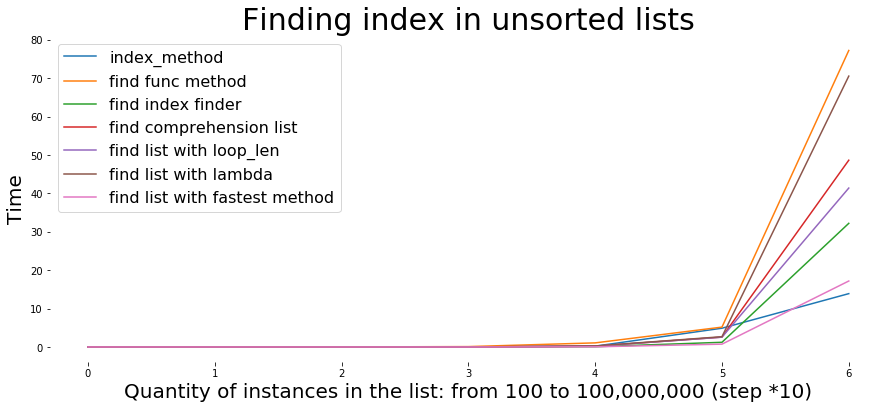

# Mission 1: Cartesian product from dictionary to list of dictionaries.

*No imports - harder version*


```python
input1 = {
    "szerokość": {"20cm", "16cm", "10cm"},
    "wysokość": {"30cm", "40cm"},
    "kolor": {"czarny", "biały", "zielony"}
}

def product_x(*args):
    # product('ABC', 'xy') --> Ax Ay Bx By Cx
    pools = [tuple(pool) for pool in args]
    result = [[]]
    for pool in pools:
        result = [x+[y] for x in result for y in pool]
    return result
    # # if tuple output is needed:
    # for prod in result:
    #     yield tuple(prod)


def dict_product(dicts):

    """
    Function cartesian product for dictionaries.
    Nested function `product_x` is an engine that create all computations necessary.
    `dict_product` is dedicated for dictionary case - as input.


    *dicts return keys
    *dicts.values() return values
    """
    return (dict(zip(dicts.keys(), val)) for val in product_x(*dicts.values()))

print(list(dict_product(input1)))
```

    [{'szerokość': '20cm', 'wysokość': '40cm', 'kolor': 'czarny'}, {'szerokość': '20cm', 'wysokość': '40cm', 'kolor': 'zielony'}, {'szerokość': '20cm', 'wysokość': '40cm', 'kolor': 'biały'}, {'szerokość': '20cm', 'wysokość': '30cm', 'kolor': 'czarny'}, {'szerokość': '20cm', 'wysokość': '30cm', 'kolor': 'zielony'}, {'szerokość': '20cm', 'wysokość': '30cm', 'kolor': 'biały'}, {'szerokość': '10cm', 'wysokość': '40cm', 'kolor': 'czarny'}, {'szerokość': '10cm', 'wysokość': '40cm', 'kolor': 'zielony'}, {'szerokość': '10cm', 'wysokość': '40cm', 'kolor': 'biały'}, {'szerokość': '10cm', 'wysokość': '30cm', 'kolor': 'czarny'}, {'szerokość': '10cm', 'wysokość': '30cm', 'kolor': 'zielony'}, {'szerokość': '10cm', 'wysokość': '30cm', 'kolor': 'biały'}, {'szerokość': '16cm', 'wysokość': '40cm', 'kolor': 'czarny'}, {'szerokość': '16cm', 'wysokość': '40cm', 'kolor': 'zielony'}, {'szerokość': '16cm', 'wysokość': '40cm', 'kolor': 'biały'}, {'szerokość': '16cm', 'wysokość': '30cm', 'kolor': 'czarny'}, {'szerokość': '16cm', 'wysokość': '30cm', 'kolor': 'zielony'}, {'szerokość': '16cm', 'wysokość': '30cm', 'kolor': 'biały'}]
    

# Mission 2: Faster methods for finding index than the `index` method.
*No imports - harder version*


```python
def fastest_index_method(my_list, item):
    """
    returns index of x in ordered list.
    If x is between two items in the list, the index of the lower one is returned.
    """

    l = len(my_list)  # 5
    i = l // 2  # 2
    j = i // 2  # 1

    while (j > 0):
        if item < my_list[i]:
            i -= j
        else:
            i += j
        j = j // 2

    if item not in my_list:
        return None

    return i
```

-------------------
More deep and exciting answers for **mission 2** are below!

I will present a bunch of faster methods with `timeit` library (for speed tests). 
I will also use `matplotlib` for better visualisation of the output.

*Disclaimer: besides the fact that I import some stuff below, it doesn't have anything to do with finding a solution for the problem in a "harder way". **It's still the "without import" version**! Things imported are just for a better presentation of my point.


```python
import random
import timeit
import pandas as pd

# The Jupyter magic %matplotlib inline allows plots to be displayed inline.
%matplotlib inline 
import matplotlib.pyplot as plt


"""
I will define a seed for random. 
With this approach 
I can test the time of execution with the seam result each time, 
because the list will have the same content every time.
"""
random.seed(2)

"""
I will create a few lists with 

list_a -> 100 numbers selected from the range 0 to 100 without duplicates.
list_b -> 1,000 numbers selected from the range 0 to 1,000 without duplicates.
list_c -> 10,000 numbers selected from the range 0 to 10,000 without duplicates.
list_d -> 100,000 numbers selected from the range 0 to 100,000 without duplicates.
list_e -> 1,000,000 numbers selected from the range 0 to 1,000,000 without duplicates.
list_f -> 10,000,000 numbers selected from the range 0 to 10,000,000 without duplicates.
list_g -> 100,000,000 numbers selected from the range 0 to 100,000,000 without duplicates.
"""
list_a = random.sample(range(101), 100)
list_b = random.sample(range(1001), 1000)
list_c = random.sample(range(10001), 10000)
list_d = random.sample(range(100001), 100000)
list_e = random.sample(range(1000001), 1000000)
list_f = random.sample(range(10000001), 10000000)
list_g = random.sample(range(100000001), 100000000)
# list_h = random.sample(range(1000000001), 1000000000) # `list_h` discarded (not enough memory)


list_all_index_method_time = []
final_data_output = {}

start = timeit.default_timer()
l_ind_a = list_a.index(1)
stop = timeit.default_timer()
# print('Time: index list with `index`: ', stop - start)
list_a_index_method_time = stop - start
list_all_index_method_time.append(list_a_index_method_time)

start = timeit.default_timer()
l_ind_b = list_b.index(1)
stop = timeit.default_timer()
# print('Time: index list with `index`: ', stop - start)
list_b_index_method_time = stop - start
list_all_index_method_time.append(list_b_index_method_time)

start = timeit.default_timer()
l_ind_c = list_c.index(1)
stop = timeit.default_timer()
# print('Time: index list with `index`: ', stop - start)
list_c_index_method_time = stop - start
list_all_index_method_time.append(list_c_index_method_time)

start = timeit.default_timer()
l_ind_d = list_d.index(1)
stop = timeit.default_timer()
# print('Time: index list with `index`: ', stop - start)
list_d_index_method_time = stop - start
list_all_index_method_time.append(list_d_index_method_time)

start = timeit.default_timer()
l_ind_e = list_e.index(1)
stop = timeit.default_timer()
# print('Time: index list with `index`: ', stop - start)
list_e_index_method_time = stop - start
list_all_index_method_time.append(list_e_index_method_time)

start = timeit.default_timer()
l_ind_f = list_f.index(1)
stop = timeit.default_timer()
# print('Time: index list with `index`: ', stop - start)
list_f_index_method_time = stop - start
list_all_index_method_time.append(list_f_index_method_time)

start = timeit.default_timer()
l_ind_g = list_g.index(1)
stop = timeit.default_timer()
# print('Time: index list with `index`: ', stop - start)
list_g_index_method_time = stop - start
list_all_index_method_time.append(list_g_index_method_time)

# start = timeit.default_timer() # `list_h` discarded (not enough memory)
# l_ind_h = list_h.index(1)
# stop = timeit.default_timer()
# # print('Time: index list with `index`: ', stop - start)
# list_h_index_method_time = stop - start
# list_all_index_method_time.append(list_h_index_method_time)

final_data_output["index_method"] = list_all_index_method_time

all_random_lists = [list_a, list_b, list_c, list_d, list_e, list_f, list_g] # `list_h` discarded (not enough memory)
 
# Sorted lists:
for i_list in all_random_lists:
    i_list = i_list.sort()

print(list_a) # Test


list_all_find_func_time = []
list_all_find_index_finder_func_time = []
list_all_find_comprehension_list_time = []
list_all_find_list_with_loop_len_time = []
list_all_find_list_with_lambda_time = []
list_all_find_list_fastest_method_time = []

"""
List of method that will be tested:
"""


def find(my_list, item):
    if item not in my_list:
        print(None)
    for i in range(len(my_list)):
        if my_list[i] == item:
            yield i


def index_finder(my_list, item):
    """A generator function, if you might not need all the indices"""
    start = 0

    while True:
        try:
            start = my_list.index(item, start)
            yield start
            start += 1
        except ValueError:
            break
        except IndexError:
            return None


def index_of(my_list, item):
    item_e = enumerate(my_list)
    item_f = list(filter(lambda x: x[1] == item, item_e))
    if item not in my_list:
        return None
    elif item_f:
        return item_f[0][0]
    else:
        return -1


def enumerate_index(my_list, item):
    if item not in my_list:
        return None

    indices = [i for i, x in enumerate(my_list) if x == item]
    return indices[0]


def loop_index(my_list, item):
    count = 0
    indices = []

    if item not in my_list:
        return None

    for i in range(0, len(my_list)):
        if item == my_list[i]:
            indices.append(i)

    return indices[0]


def index_of(my_list, item):
    item_e = enumerate(my_list)
    item_f = list(filter(lambda x: x[1] == item, item_e))

    if item_f:
        return item_f[0][0]
    else:
        return -1


def fastest_index_method(my_list, item):
    """
    returns index of x in ordered list.
    If x is between two items in the list, the index of the lower one is returned.
    """

    l = len(my_list)  # 5
    i = l // 2  # 2
    j = i // 2  # 1

    while (j > 0):
        if item < my_list[i]:
            i -= j
        else:
            i += j
        j = j // 2

    if item not in my_list:
        return None

    return i


for name in all_random_lists:
    # loop related to `find()` method:
    start = timeit.default_timer()
    l_ind_find = list(find(name, 1))[0]
    stop = timeit.default_timer()
    # print('Time: index list with `find()` func: ', stop - start) # test
    list_find_func_method_time = stop - start
    list_all_find_func_time.append(list_find_func_method_time)

    # loop related to `index_finder()`method:
    start = timeit.default_timer()
    l_ind_i_find = list(index_finder(name, 1))[0]
    stop = timeit.default_timer()
    # print('Time: index list with `find()` func: ', stop - start) # test
    list_find_index_finder_func_time = stop - start
    list_all_find_index_finder_func_time.append(list_find_index_finder_func_time)

    # loop related to comprehension list method:
    start = timeit.default_timer()
    l_ind_enum = enumerate_index(name, 1)
    stop = timeit.default_timer()
    list_find_comprehension_list_time = stop - start
    list_all_find_comprehension_list_time.append(list_find_comprehension_list_time)

    # loop related to loop len method:
    start = timeit.default_timer()
    l_ind_loop_idx = loop_index(name, 1)
    stop = timeit.default_timer()
    list_find_list_with_loop_len_time = stop - start
    list_all_find_list_with_loop_len_time.append(list_find_list_with_loop_len_time)

    # loop related to index list with lambda method:
    start = timeit.default_timer()
    l_ind_mabda = index_of(name, 1)
    stop = timeit.default_timer()
    list_find_list_with_lambda_time = stop - start
    list_all_find_list_with_lambda_time.append(list_find_list_with_lambda_time)

    # loop related to the fastest method:
    start = timeit.default_timer()
    l_ind_fastest = fastest_index_method(name, 1)
    stop = timeit.default_timer()
    list_find_list_with_fastest_method_time = stop - start
    list_all_find_list_fastest_method_time.append(list_find_list_with_fastest_method_time)

final_data_output["find func method"] = list_all_find_func_time
final_data_output["find index finder"] = list_all_find_index_finder_func_time
final_data_output["find comprehension list"] = list_all_find_comprehension_list_time
final_data_output["find list with loop_len"] = list_all_find_list_with_loop_len_time
final_data_output["find list with lambda"] = list_all_find_list_with_lambda_time
final_data_output["find list with fastest method"] = list_all_find_list_fastest_method_time

df = pd.DataFrame(final_data_output)

"""Print an entire pandas DataFrame in Python:"""
pd.set_option("display.max_rows", None, "display.max_columns", None)
print(df)

# pd.DataFrame.plot(df)


```

    [1, 2, 3, 4, 5, 6, 7, 8, 9, 10, 11, 12, 13, 14, 15, 16, 17, 18, 19, 20, 21, 22, 23, 24, 25, 26, 27, 28, 29, 30, 31, 32, 33, 34, 35, 36, 37, 38, 39, 40, 41, 42, 43, 44, 45, 46, 47, 48, 49, 50, 51, 52, 53, 54, 55, 56, 57, 58, 59, 60, 61, 62, 63, 64, 65, 66, 67, 68, 69, 70, 71, 72, 73, 74, 75, 76, 77, 78, 79, 80, 81, 82, 83, 84, 85, 86, 87, 88, 89, 90, 91, 92, 93, 94, 95, 96, 97, 98, 99, 100]
       index_method  find func method  find index finder  find comprehension list  \
    0      0.005562          0.000026           0.000994                 0.000854   
    1      0.002823          0.001366           0.000019                 0.000051   
    2      0.001179          0.001982           0.000136                 0.000505   
    3      0.014363          0.048718           0.001286                 0.006844   
    4      0.159779          0.350494           0.012890                 0.049823   
    5      2.121732          2.668513           0.169755                 0.610654   
    6     10.053583          7.832876           1.860117                 5.622634   
    
       find list with loop_len  find list with lambda  \
    0                 0.000010               0.001441   
    1                 0.000046               0.000137   
    2                 0.000451               0.001349   
    3                 0.004706               0.014914   
    4                 0.046690               0.140333   
    5                 0.503717               1.605988   
    6                 5.377324              15.251060   
    
       find list with fastest method  
    0                       0.000003  
    1                       0.000002  
    2                       0.000003  
    3                       0.000010  
    4                       0.000011  
    5                       0.000017  
    6                       0.000089  
    


```python
df
```


<div>
<style scoped>
    .dataframe tbody tr th:only-of-type {
        vertical-align: middle;
    }

    .dataframe tbody tr th {
        vertical-align: top;
    }

    .dataframe thead th {
        text-align: right;
    }
</style>
<table border="1" class="dataframe">
  <thead>
    <tr style="text-align: right;">
      <th></th>
      <th>index_method</th>
      <th>find func method</th>
      <th>find index finder</th>
      <th>find comprehension list</th>
      <th>find list with loop_len</th>
      <th>find list with lambda</th>
      <th>find list with fastest method</th>
    </tr>
  </thead>
  <tbody>
    <tr>
      <td>0</td>
      <td>0.005562</td>
      <td>0.000026</td>
      <td>0.000994</td>
      <td>0.000854</td>
      <td>0.000010</td>
      <td>0.001441</td>
      <td>0.000003</td>
    </tr>
    <tr>
      <td>1</td>
      <td>0.002823</td>
      <td>0.001366</td>
      <td>0.000019</td>
      <td>0.000051</td>
      <td>0.000046</td>
      <td>0.000137</td>
      <td>0.000002</td>
    </tr>
    <tr>
      <td>2</td>
      <td>0.001179</td>
      <td>0.001982</td>
      <td>0.000136</td>
      <td>0.000505</td>
      <td>0.000451</td>
      <td>0.001349</td>
      <td>0.000003</td>
    </tr>
    <tr>
      <td>3</td>
      <td>0.014363</td>
      <td>0.048718</td>
      <td>0.001286</td>
      <td>0.006844</td>
      <td>0.004706</td>
      <td>0.014914</td>
      <td>0.000010</td>
    </tr>
    <tr>
      <td>4</td>
      <td>0.159779</td>
      <td>0.350494</td>
      <td>0.012890</td>
      <td>0.049823</td>
      <td>0.046690</td>
      <td>0.140333</td>
      <td>0.000011</td>
    </tr>
    <tr>
      <td>5</td>
      <td>2.121732</td>
      <td>2.668513</td>
      <td>0.169755</td>
      <td>0.610654</td>
      <td>0.503717</td>
      <td>1.605988</td>
      <td>0.000017</td>
    </tr>
    <tr>
      <td>6</td>
      <td>10.053583</td>
      <td>7.832876</td>
      <td>1.860117</td>
      <td>5.622634</td>
      <td>5.377324</td>
      <td>15.251060</td>
      <td>0.000089</td>
    </tr>
  </tbody>
</table>
</div>


I will create a plot chart for a better understanding of the output.


```python
fig1, ax = plt.subplots(figsize=(15,6))
ax.set_axisbelow(True)
ax.plot(df)
    
ax.set_title(
    'Finding index in sorted lists',
    fontsize=30
)

ax.set_xlabel("Quantity of instances in the list: from 100 to 100,000,000 (step *10)", fontsize=20)
ax.set_ylabel("Time", fontsize=20)
ax.legend(df, loc='upper left', fontsize=16)


ax.spines["right"].set_visible(False)    
ax.spines["left"].set_visible(False)
ax.spines["top"].set_visible(False)    
ax.spines["bottom"].set_visible(False)

plt.show()
```





As we can see regular `index` method isn't the fastest. Function `fastest method` is significantly faster than others for sorted lists greater than **1,000,000** numbers. 

### Below unsorted list version for lists of the same range - I made it out of curiosity:


```python
import random
import timeit
import pandas as pd

"""
I will define a seed for random. 
With this approach 
I can test the time of execution with the seam result each time, 
because the list will have the same content every time.
"""
random.seed(2)

"""
I will create a few lists with 

list_a -> 100 numbers selected from the range 0 to 100 without duplicates.
list_b -> 1,000 numbers selected from the range 0 to 1,000 without duplicates.
list_c -> 10,000 numbers selected from the range 0 to 10,000 without duplicates.
list_d -> 100,000 numbers selected from the range 0 to 100,000 without duplicates.
list_e -> 1,000,000 numbers selected from the range 0 to 1,000,000 without duplicates.
list_f -> 10,000,000 numbers selected from the range 0 to 10,000,000 without duplicates.
list_g -> 100,000,000 numbers selected from the range 0 to 100,000,000 without duplicates.
"""
list_a = random.sample(range(101), 100)
list_b = random.sample(range(1001), 1000)
list_c = random.sample(range(10001), 10000)
list_d = random.sample(range(100001), 100000)
list_e = random.sample(range(1000001), 1000000)
list_f = random.sample(range(10000001), 10000000)
list_g = random.sample(range(100000001), 100000000)


list_all_index_method_time = []
final_data_output = {}

start = timeit.default_timer()
l_ind_a = list_a.index(1)
stop = timeit.default_timer()
# print('Time: index list with `index`: ', stop - start)
list_a_index_method_time = stop - start
list_all_index_method_time.append(list_a_index_method_time)

start = timeit.default_timer()
l_ind_b = list_b.index(1)
stop = timeit.default_timer()
# print('Time: index list with `index`: ', stop - start)
list_b_index_method_time = stop - start
list_all_index_method_time.append(list_b_index_method_time)

start = timeit.default_timer()
l_ind_c = list_c.index(1)
stop = timeit.default_timer()
# print('Time: index list with `index`: ', stop - start)
list_c_index_method_time = stop - start
list_all_index_method_time.append(list_c_index_method_time)

start = timeit.default_timer()
l_ind_d = list_d.index(1)
stop = timeit.default_timer()
# print('Time: index list with `index`: ', stop - start)
list_d_index_method_time = stop - start
list_all_index_method_time.append(list_d_index_method_time)

start = timeit.default_timer()
l_ind_e = list_e.index(1)
stop = timeit.default_timer()
# print('Time: index list with `index`: ', stop - start)
list_e_index_method_time = stop - start
list_all_index_method_time.append(list_e_index_method_time)

start = timeit.default_timer()
l_ind_f = list_f.index(1)
stop = timeit.default_timer()
# print('Time: index list with `index`: ', stop - start)
list_f_index_method_time = stop - start
list_all_index_method_time.append(list_f_index_method_time)

start = timeit.default_timer()
l_ind_g = list_g.index(1)
stop = timeit.default_timer()
# print('Time: index list with `index`: ', stop - start)
list_g_index_method_time = stop - start
list_all_index_method_time.append(list_g_index_method_time)


final_data_output["index_method"] = list_all_index_method_time

all_random_lists = [list_a, list_b, list_c, list_d, list_e, list_f, list_g]

# # Sorted lists:
# for i_list in all_random_lists:
#     i_list = i_list.sort()

# print(list_a) # Test


list_all_find_func_time = []
list_all_find_index_finder_func_time = []
list_all_find_comprehension_list_time = []
list_all_find_list_with_loop_len_time = []
list_all_find_list_with_lambda_time = []
list_all_find_list_fastest_method_time = []

"""
List of method that will be tested:
"""


def find(my_list, item):
    if item not in my_list:
        print(None)
    for i in range(len(my_list)):
        if my_list[i] == item:
            yield i


def index_finder(my_list, item):
    """A generator function, if you might not need all the indices"""
    start = 0

    while True:
        try:
            start = my_list.index(item, start)
            yield start
            start += 1
        except ValueError:
            break
        except IndexError:
            return None


def index_of(my_list, item):
    item_e = enumerate(my_list)
    item_f = list(filter(lambda x: x[1] == item, item_e))
    if item not in my_list:
        return None
    elif item_f:
        return item_f[0][0]
    else:
        return -1


def enumerate_index(my_list, item):
    if item not in my_list:
        return None

    indices = [i for i, x in enumerate(my_list) if x == item]
    return indices[0]


def loop_index(my_list, item):
    count = 0
    indices = []

    if item not in my_list:
        return None

    for i in range(0, len(my_list)):
        if item == my_list[i]:
            indices.append(i)

    return indices[0]


def index_of(my_list, item):
    item_e = enumerate(my_list)
    item_f = list(filter(lambda x: x[1] == item, item_e))

    if item_f:
        return item_f[0][0]
    else:
        return -1


def fastest_index_method(my_list, item):
    """
    returns index of x in ordered list.
    If x is between two items in the list, the index of the lower one is returned.
    """

    l = len(my_list)  # 5
    i = l // 2  # 2
    j = i // 2  # 1

    while (j > 0):
        if item < my_list[i]:
            i -= j
        else:
            i += j
        j = j // 2

    if item not in my_list:
        return None

    return i


for name in all_random_lists:
    # loop related to `find()` method:
    start = timeit.default_timer()
    l_ind_find = list(find(name, 1))[0]
    stop = timeit.default_timer()
    # print('Time: index list with `find()` func: ', stop - start) # test
    list_find_func_method_time = stop - start
    list_all_find_func_time.append(list_find_func_method_time)

    # loop related to `index_finder()`method:
    start = timeit.default_timer()
    l_ind_i_find = list(index_finder(name, 1))[0]
    stop = timeit.default_timer()
    # print('Time: index list with `find()` func: ', stop - start) # test
    list_find_index_finder_func_time = stop - start
    list_all_find_index_finder_func_time.append(list_find_index_finder_func_time)

    # loop related to comprehension list method:
    start = timeit.default_timer()
    l_ind_enum = enumerate_index(name, 1)
    stop = timeit.default_timer()
    list_find_comprehension_list_time = stop - start
    list_all_find_comprehension_list_time.append(list_find_comprehension_list_time)

    # loop related to loop len method:
    start = timeit.default_timer()
    l_ind_loop_idx = loop_index(name, 1)
    stop = timeit.default_timer()
    list_find_list_with_loop_len_time = stop - start
    list_all_find_list_with_loop_len_time.append(list_find_list_with_loop_len_time)

    # loop related to index list with lambda method:
    start = timeit.default_timer()
    l_ind_mabda = index_of(name, 1)
    stop = timeit.default_timer()
    list_find_list_with_lambda_time = stop - start
    list_all_find_list_with_lambda_time.append(list_find_list_with_lambda_time)

    # loop related to the fastest method:
    start = timeit.default_timer()
    l_ind_fastest = fastest_index_method(name, 1)
    stop = timeit.default_timer()
    list_find_list_with_fastest_method_time = stop - start
    list_all_find_list_fastest_method_time.append(list_find_list_with_fastest_method_time)

final_data_output["find func method"] = list_all_find_func_time
final_data_output["find index finder"] = list_all_find_index_finder_func_time
final_data_output["find comprehension list"] = list_all_find_comprehension_list_time
final_data_output["find list with loop_len"] = list_all_find_list_with_loop_len_time
final_data_output["find list with lambda"] = list_all_find_list_with_lambda_time
final_data_output["find list with fastest method"] = list_all_find_list_fastest_method_time

df1 = pd.DataFrame(final_data_output)

"""Print an entire pandas DataFrame in Python:"""
pd.set_option("display.max_rows", None, "display.max_columns", None)
print(df1)

# pd.DataFrame.plot(df)


```

       index_method  find func method  find index finder  find comprehension list  \
    0      0.001768          0.001943           0.005476                 0.005689   
    1      0.001427          0.008896           0.000025                 0.000053   
    2      0.005005          0.010580           0.000157                 0.000545   
    3      0.017325          0.097550           0.003828                 0.009040   
    4      0.212872          1.065986           0.066869                 0.206019   
    5      4.883880          5.170169           1.218706                 2.570130   
    6     13.887758         77.207729          32.194760                48.632078   
    
       find list with loop_len  find list with lambda  \
    0                 0.001890               0.000052   
    1                 0.000048               0.000139   
    2                 0.000488               0.001370   
    3                 0.006807               0.016031   
    4                 0.210608               0.264425   
    5                 2.550545               2.671619   
    6                41.379692              70.531000   
    
       find list with fastest method  
    0                       0.000017  
    1                       0.000003  
    2                       0.000022  
    3                       0.000942  
    4                       0.042493  
    5                       0.732550  
    6                      17.177640  
    


```python
fig1, ax = plt.subplots(figsize=(15,6))
ax.set_axisbelow(True)
ax.plot(df1)
    
ax.set_title(
    'Finding index in unsorted lists',
    fontsize=30
)

ax.set_xlabel("Quantity of instances in the list: from 100 to 100,000,000 (step *10)", fontsize=20)
ax.set_ylabel("Time", fontsize=20)
ax.legend(df1, loc='upper left', fontsize=16)


ax.spines["right"].set_visible(False)    
ax.spines["left"].set_visible(False)
ax.spines["top"].set_visible(False)    
ax.spines["bottom"].set_visible(False)

plt.show()
```





For unsorted numbers, it takes more time to find a proper index. But here, also `fastest method` is the fastest. Significantly faster for unsorted list with **10,000,000** numbers. 
